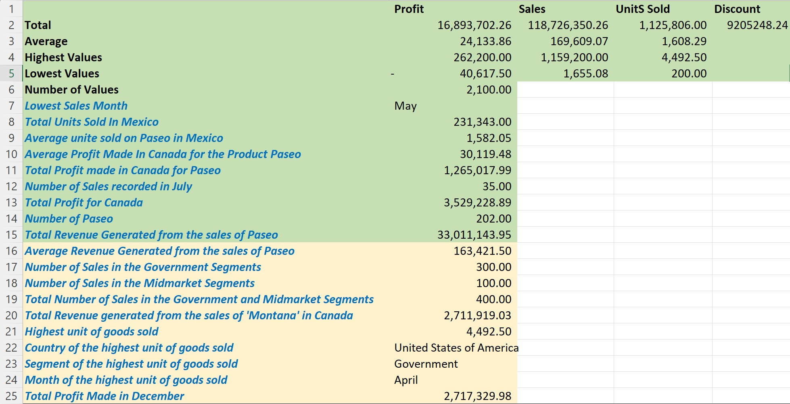

# HamsInstituteofTechnology
A dummy dataset to analyze employees' data
## 1.0  Introduction
This project aims to analyze the data of twenty employees at Hams Institute of Technology. The data contains the employee's full name, ID, and the type of job (Part-time, contract, and freelancer). The data also contains twenty employees earning between $5000 to $25,000 annually in the Communication, Sales, and IT Department.
## 2.0 Problem Statement
The objective of this project is categorized into there. 
1. To show freelancers earning above $10,000
2. To split employee full names into two separate columns (First name and Last name)
3. To identify employees whose name begins with the letter “E” and to visualize the highest and lowest-paid employees.
## 3.0 Skills Demonstrated
Problem creation via data sourcing, Problem-solving, Data Visualization, and Data Sourcing
# Data Acquisition and Transformation
The available dataset used for this project was curated my the Analyst using random numbers and values. The data contains five variables in columns and 20 rows of data. 

## 4.0 Analysis and Visualization
1. To show the freelancers earning above $10,000, the data were filtered based on the job type and Salary, as seen in the screenshot below. The freelancers earning above $10,000 annually are Adeseye Moses, James Egbowon, Taiwo Oshodi, and Kolawole Ikotun earning $12,000, $12,000, $11,500, and $18,000 respectively.

2. Split the Employee Names into two different columns.
In the data tools under the data tab, the text-to-column function separates the texts in a data column into two separate columns. By following the prompts, click on delimited, and the next, and then check in the space, since the values are separated by a space. 

3. From the list of employees, there is no employee with a name beginning with the letter ‘E’ from the list of employees on the database. Furthermore, the highest and lowest-paid employees are Soliu Kafilat ($19,800) and Chukwudi Okwudili ($5,000).

## 5.0 Conclusion and Recommendation
The analysis concluded that the highest paid in the organization are freelancers earning up to $19,800 annually and the least salary earners are in the sales department. We proposed a 15% increase for the employees of the sales department in order to improve their efficiency and to meet the overall goal of the institute. 

# Sales Data 
The sales data was analyzed using Microsoft Excel and the result is illustrated in the image below.

